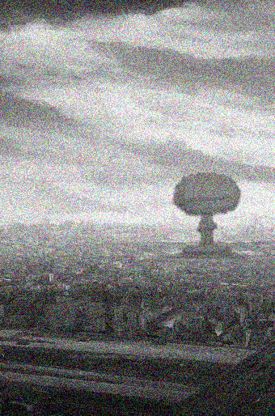

# NOVEMBER 5015U
## HONG-COLEMAN DECLARES STATE OF EMERGENCY

In a press release held by a Hong-Coleman spokesperson, The Hong-Coleman Corperation has formally declared a state of emergency. Coming off the tail of a lockdown to ensure the peace, and mere days after some of the heaviest fighting was seen within Redforge, the spokesperson immediately began by explaining that top Hong-Coleman cryptographers had deciphered a signal being broadcast within Redforge. Hong-Coleman mechanized infantry investigated the source of the signals and found nuclear weapons being reconstructed within the city. Expert analysis of the signal, along with revolutionist mechs being uncovered by Hong-Coleman security, shows clear evidence that points to Clearday being the culprit.

The spokesperson continued, "Further evidence from captured communications and overhead imagery it is obvious that Clearday has been moving munitions into striking range of Hong-Coleman assets. This is unacceptable and a clear violation of the terms our parties have agreed upon. Effective immediately Hong-Coleman will be implementing a multitude of travel, trade, and diplomatic sanctions against Clearday. In addition, Hong-Coleman will be scaling back our contributions within the Perax united Colonies organization if they do not denounce Clearday."

The spokesperson continued with a request of PUC partners to partake in the following actions:
1) Formal denouncement of Clearday's activities
2) Enforce a militarized presence in Clearday for the purposes of:
- Launching a full scale investigation into this clear aggression against Hong-Coleman
- Making arrests against the persons responsible
- Establishing extended security protocols to ensure that Clearday's stockpile of munitions are adequately secured and decommissioned
- Establishing temporary martial order while Clearday's governing body is investigated, held accountable, and reformed into a new system of government not controlled by known terrorist cells
- Hong-Coleman, as the damaged party, will take command of this presence so that all the above are performed to Hong-Coleman's standards of acceptance
3) TiTech's role in Clearday affairs and in the security presence outlined in (2) is kept to minimal or non-existent levels, given the colony's known affiliations and treaties with Clearday and its terrorist-linked government; TiTech will offer no resistance or asylum to Clearday's residents or officials during this period

Hong-Coleman has begun moving it's mechanized infantry to its borders, after securing Redforge from a terrorist cell linked to revolutionaries that had infiltrated the city. The same cell was found to be responsible for the power outages and material shortages occurring within Redforge during the lockdown. Hong-Coleman has promised the safety of its citizens are paramount. "Clearday is weak, striking at citizens as they know they cannot face Hong-Coleman military might head on. Clearday underestimates the strength and will of our people. Clearday will face dire consequences for such atrocities. Our bothers and sisters in arms will show the absolute resolve of our people against such an insidious threat."